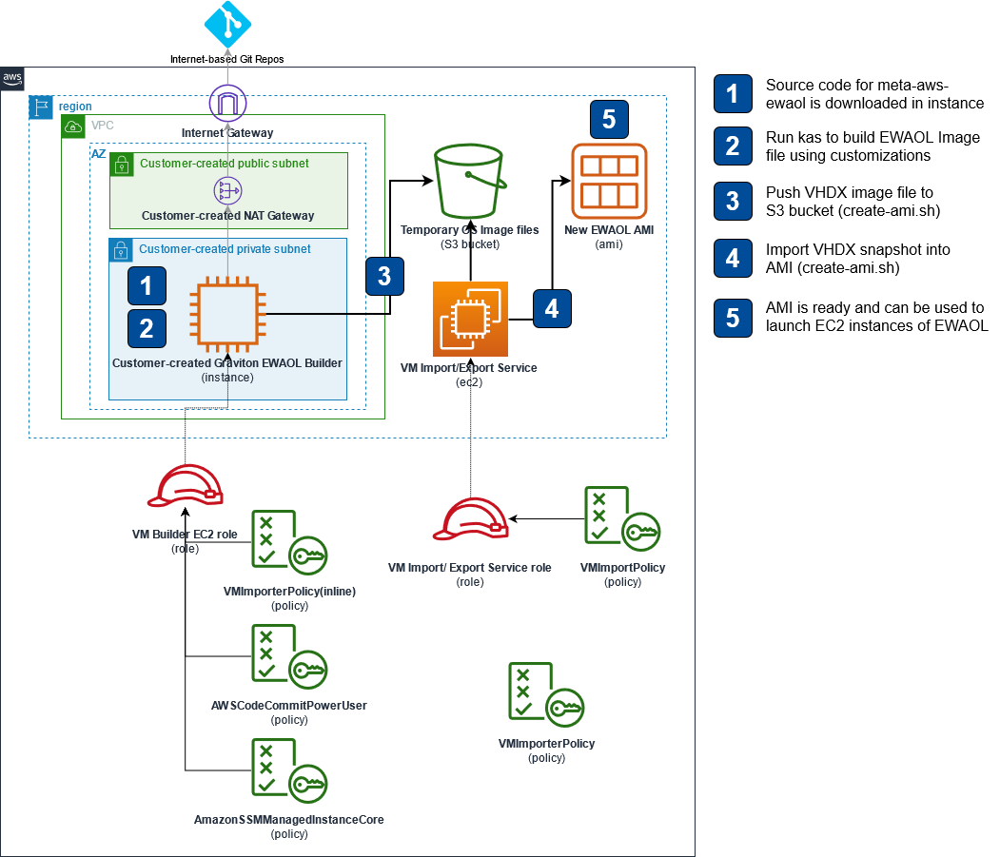

# The meta-aws-ewaol repository
This repository provides the example code and instructions for building a customized [Edge Workload Abstraction and Orchestration Layer](https://ewaol.sites.arm.com/meta-ewaol/overview.html) (EWAOL) distribution in form of an [Amazon Machine Image](https://docs.aws.amazon.com/AWSEC2/latest/UserGuide/AMIs.html) (AMI). 



## Build instructions

### Pre-requisites

1. An AWS account and the necessary IAM rights to create EC2 instances, EBS snapshots, EBS volumes, S3 buckets, and IAM roles and policies.
1. A VPC with appropriate subnets and routing required to access the build server.
1. The resources created by deploying the [VMImport CloudFormation Template](cfn/vmimport-cfn.yml) (roles, policies, S3 bucket for images).
    1. Take note of the outputs of the stack deployment as they'll be needed in the following steps

1. An arm64 Ubuntu 20.04 EC2 instance using Graviton processor (e.g. c6g.4xlarge) with 100GB+ root disk with internet access using the instance profile created by the CloudFormation template from previous step (VMBuilderEC2Role).

### Build Dependencies
1. Update the Operating System and install pre-requisites for Yocto, Kas and our image creation script:
    ```bash
    sudo apt-get update
    sudo apt-get install -y gawk wget git diffstat unzip texinfo gcc build-essential chrpath socat cpio python3 python3-pip python3-pexpect xz-utils debianutils iputils-ping python3-git python3-jinja2 libegl1-mesa libsdl1.2-dev pylint3 xterm python3-subunit mesa-common-dev make python3-pip jq zstd liblz4-tool
    ```

1. Install AWS CLI v2

    ```bash
    curl "https://awscli.amazonaws.com/awscli-exe-linux-aarch64.zip" -o "/tmp/awscliv2.zip"
    unzip /tmp/awscliv2.zip -d /tmp
    sudo /tmp/aws/install
    ```

1. Install the python packages:

    ```bash
    sudo pip3 install sphinx sphinx_rtd_theme pyyaml kas==3.0.2 git-remote-codecommit
    ```

### Building EWAOL

1. Clone the repo from the instance or upload the code and invoke build command. For example:

    ```bash
    git clone https://github.com/aws4embeddedlinux/meta-aws-ewaol.git
    cd meta-aws-ewaol
    ```

1. Customize the ewaol-graviton2-ami.yaml as needed and invoke build.

    ```bash
    kas build kas/machines/ewaol-graviton2-ami.yaml
    ```

### Creating AMI from image file

From meta-aws-ewaol directory, run the bash script. Replace <S3_BUCKET_IMPORT_IMAGES> with the bucket name created by the CloudFormation Stack in the pre-requisites section and choose the appropriate size for the future root disk of AMI to have by entering a number (e.g. 16) in place of <AMI_DISK_SIZE_IN_GB> :

```bash
bash scripts/create-ami.sh <S3_BUCKET_IMPORT_IMAGES> <AMI_DISK_SIZE_IN_GB>
```

## Launch the EC2 Image as usual using your newly created AMI

1. In the Web Console, Navigate to EC2->Images->AMIs
1. Select the desired AMI and click 'Launch instance from Image'
1. Follow the wizard as usual
1. Access the image with the previously provided ssh key with user **ewaol**

## Limitations

The image does not yet support online expansion of partitions/filesystems via cloud-init.
Follow the below workaround to expand root partition and filesystem (this can be used as user data script):

```bash
#!/bin/sh

# disabling swap
swapoff -a
sed -i '/.*swap.*/d' /etc/fstab
# trick to fix GPT
printf "fix\n" | parted ---pretend-input-tty /dev/nvme0n1 print
# remove partition 3 (swap)
parted -s /dev/nvme0n1 rm 3
# resize partition 2 to use 100% of available free space
parted -s /dev/nvme0n1 resizepart 2 100%
# resizing ext4 filesystem
resize2fs /dev/nvme0n1p2
```

## Future Enchancements

* Enable support for expanding filesystem on boot with cloud-init which depends on growpart. This needs cloud-utils which is not in openembedded recipes yet.

## Security

See [CONTRIBUTING](CONTRIBUTING.md#security-issue-notifications) for more information.

## License

This code is licensed under the MIT-0 License. See the [LICENSE](LICENSE) file.
